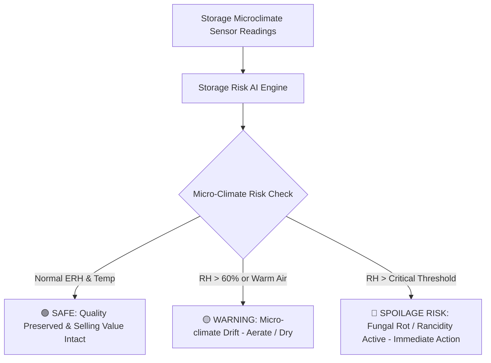

# Tribal & Agricultural Produce Storage Knowledge Guide

**Target Produce**:
1. 🌰 **Mahua** (*Madhuca longifolia*)
2. 🌱 **Tamarind** (*Tamarindus indica*)
3. 🌾 **Paddy** (*Oryza sativa*)
4. 🫘 **Pulses** (Arhar, Gram, Moong, Urad)
5. 🌿 **Medicinal & Non-Timber Forest Produce (NTFP)**
6. 🌰 **Sal Seeds** (*Shorea robusta*)
7. 🍯 **Wild Forest Honey**

---

## 1. Crop Biological Vulnerability Profiles

---

### 🌰 1. Mahua (*Madhuca longifolia*) Flowers & Seeds
- **Economic Significance**: Crucial annual income source for central and eastern Indian tribal communities (Madhya Pradesh, Chhattisgarh, Odisha, Jharkhand).
- **Vulnerability**: Mahua flowers contain up to 50–60% fermentable sugars. When ambient humidity exceeds 60%, flowers rapidly absorb moisture from the surrounding air (hygroscopic absorption). Within 48 hours of dampness, *Aspergillus niger* and yeasts propagate, turning creamy golden petals pitch black, sour, and unmarketable.
- **Optimal Conditions**:
  - Temperature: 18°C – 28°C
  - Relative Humidity: 40% – 60%
  - Critical RH: >65% (Immediate spoilage risk)
- **Farmer Protective Actions**:
  - *Dry Mahua thoroughly on raised clean tarpaulins in semi-shade before packing into gunny bags.*
  - *Never pack warm flowers directly off the ground.*
  - *Place bags on wooden pallets (20 cm off the floor) to prevent ground moisture seepage.*

---

### 🌱 2. Tamarind (*Tamarindus indica*)
- **Economic Significance**: Major Non-Timber Forest Produce collected in tribal forest fringes.
- **Vulnerability**: High concentrations of tartaric acid and hygroscopic invert sugars. Above 65% RH, moisture condenses on tamarind surfaces, creating a sticky, tar-like liquefaction. This attracts moisture bugs and pulse beetles, causing enzymatic browning and sour fermentation.
- **Optimal Conditions**:
  - Temperature: 15°C – 26°C
  - Relative Humidity: 45% – 60%
  - Critical RH: >68%
- **Farmer Protective Actions**:
  - *Press de-seeded tamarind into dense, compact blocks to eliminate air pockets.*
  - *Apply a light dusting of clean rock salt (traditional preservative technique).*
  - *Store in moisture-proof polythene-lined jute bags.*

---

### 🌾 3. Paddy (*Oryza sativa*)
- **Economic Significance**: Core staple food crop and economic security reserve for rural families.
- **Vulnerability**: If paddy is stored at grain moisture content > 14% (equivalent to equilibrium relative humidity > 70%), grain respiration accelerates dramatically. Heat generated by respiration causes hot-spots, yellowing, aflatoxin contamination, and premature sprouting.
- **Optimal Conditions**:
  - Temperature: 15°C – 28°C
  - Relative Humidity: 50% – 65%
  - Critical RH: >70%
- **Farmer Protective Actions**:
  - *Sun-dry paddy until a grain snaps crisply between teeth (indicates <13% moisture).*
  - *Aerate storage bins or traditional mud silos (Kothi/Dholi).*
  - *Ensure roof ventilation to vent rising warm moist air.*

---

### 🫘 4. Pulses (Arhar / Pigeon Pea, Gram, Moong, Urad)
- **Economic Significance**: Primary dietary protein source and high-value cash crop.
- **Vulnerability**: The pulse beetle (*Callosobruchus maculatus*) multiplies explosively at temperatures > 28°C and humidity > 65%. Larvae bore into grains, hollowing them from within and leaving perforated exit holes that destroy market value.
- **Optimal Conditions**:
  - Temperature: 16°C – 27°C
  - Relative Humidity: 40% – 60%
  - Critical RH: >65%
- **Farmer Protective Actions**:
  - *Mix dried neem leaves (*Azadirachta indica*) or inert wood ash into grain bulk.*
  - *Apply a top layer of clean dry river sand (3 cm) to prevent adult beetle egg-laying.*
  - *Sun-dry bags whenever the AI flags a Warning or Spoilage alert.*

---

### 🌿 5. Medicinal Herbs & Forest Produce (Chironji, Harra, Bahera, Kalmegh)
- **Economic Significance**: High-value raw material for Ayurvedic and pharmaceutical markets.
- **Vulnerability**: Active phytochemicals (alkaloids, tannins, glycosides, and volatile essential oils) oxidize rapidly when exposed to humidity > 55% or ambient temperatures > 30°C, causing pharmaceutical buyers to discount prices by up to 50–70%.
- **Optimal Conditions**:
  - Temperature: 15°C – 25°C
  - Relative Humidity: 35% – 55%
  - Critical RH: >62%
- **Farmer Protective Actions**:
  - *Strict shade-drying prior to storage.*
  - *Use airtight containers or multi-layer kraft paper bags.*
  - *Keep storage area completely isolated from direct sunlight and kitchen smoke.*

---

### 🌰 6. Sal Seeds (*Shorea robusta*)
- **Economic Significance**: High commercial demand for Sal butter, cosmetics, and confectionery fat.
- **Vulnerability**: Sal seed kernels contain 14–20% valuable fat. Moisture levels > 8% (RH > 60%) trigger lipolytic enzymes, rapidly increasing Free Fatty Acid (FFA) content above acceptable industry ceilings (FFA > 3% gets rejected by extraction mills).
- **Optimal Conditions**:
  - Temperature: 18°C – 28°C
  - Relative Humidity: 40% – 58%
  - Critical RH: >64%
- **Farmer Protective Actions**:
  - *Decorticate (de-wing and de-shell) without delay.*
  - *Dry immediately; never stack fresh green sal seeds in damp heaps.*

---

### 🍯 7. Wild Forest Honey
- **Economic Significance**: Premium pure organic non-timber forest produce.
- **Vulnerability**: Natural pure honey has high osmotic pressure that inhibits microbial growth. However, honey is extremely hygroscopic: if relative humidity in storage exceeds 60%, the surface absorbs atmospheric water. Once water content exceeds 18–19%, dormant osmophilic yeasts (*Zygosaccharomyces*) activate, causing foaming, alcoholic sour fermentation, and ballooning of containers.
- **Optimal Conditions**:
  - Temperature: 15°C – 24°C
  - Relative Humidity: 30% – 55%
  - Critical RH: >60%
- **Farmer Protective Actions**:
  - *Keep honey in hermetically sealed food-grade containers or stainless steel drums.*
  - *Never leave container lids open in storage rooms.*
  - *Do not expose to high temperatures (>30°C) to prevent hydroxymethylfurfural (HMF) buildup.*
